# Laboratorio 10
# Integrantes:
# 1)Yakeli Jimenez Villalobos

## Evidencia 01

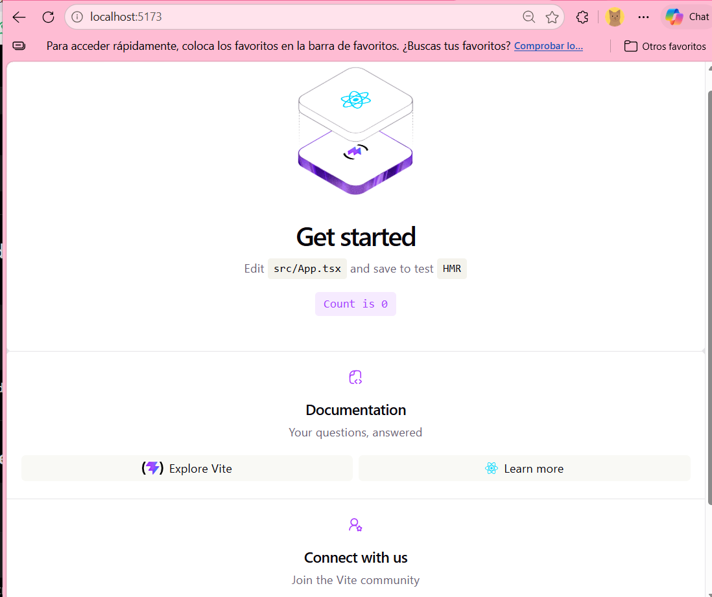

## Evidencia 02

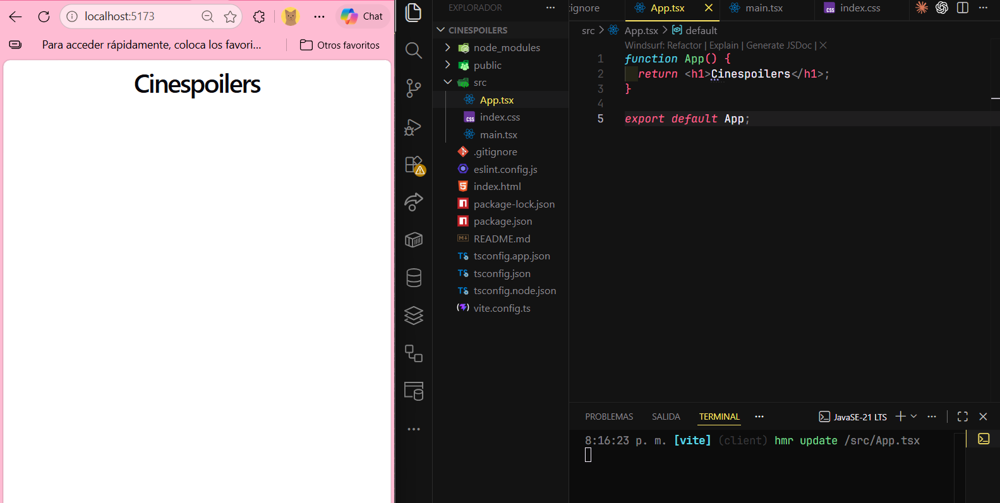

## Evidencia 03

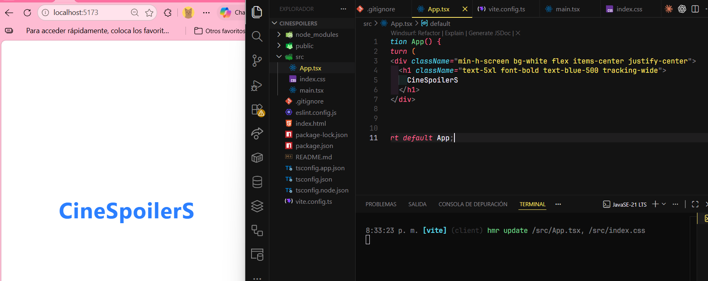

## Evidencia 05

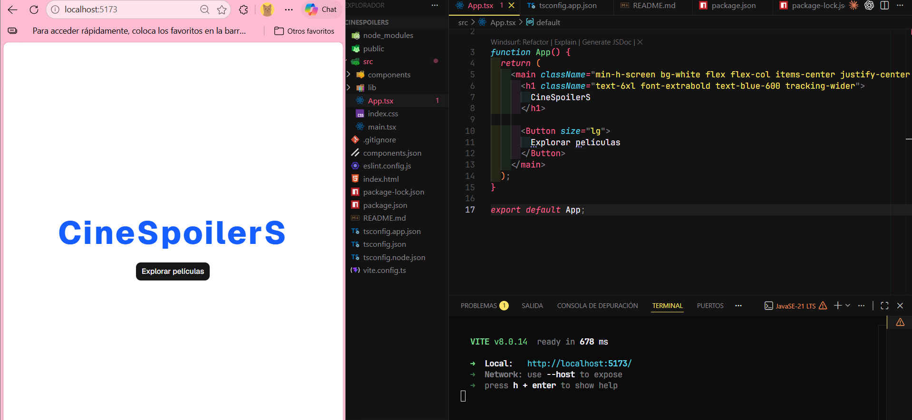

## Evidencia 06

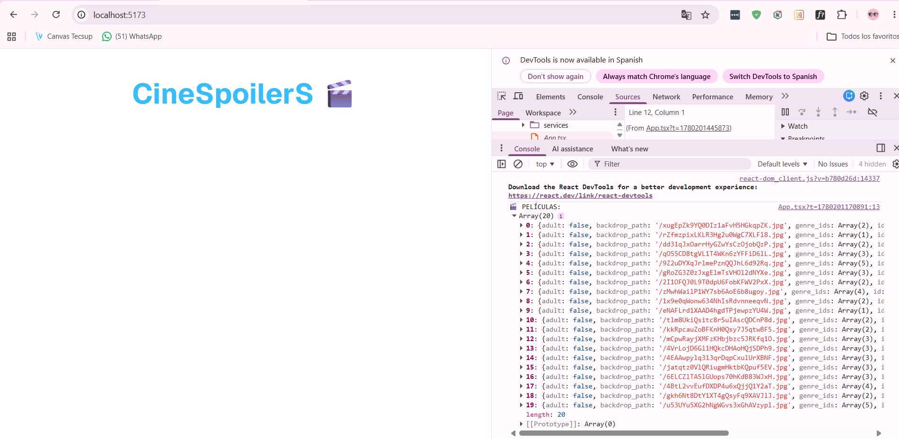

## Evidencia 07

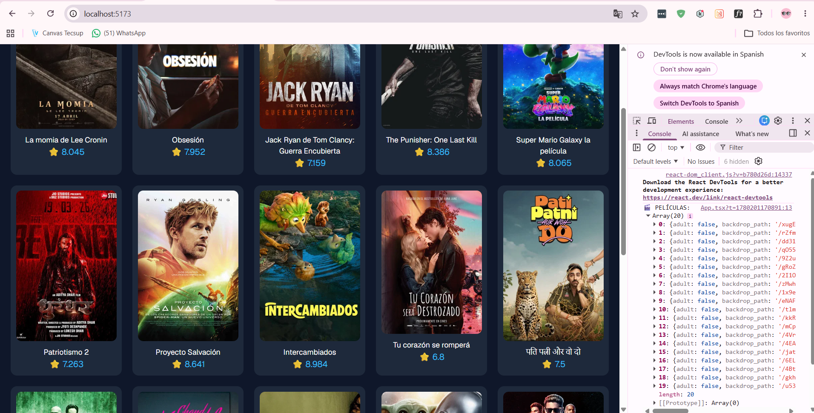

# 2)Sheyla Chuco Bravo

## Evidencia 01

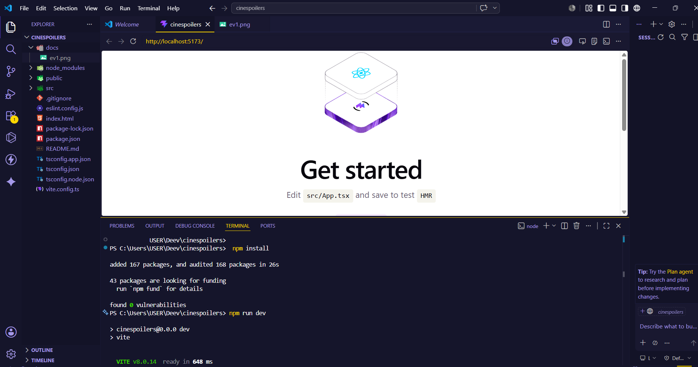

## Evidencia 02

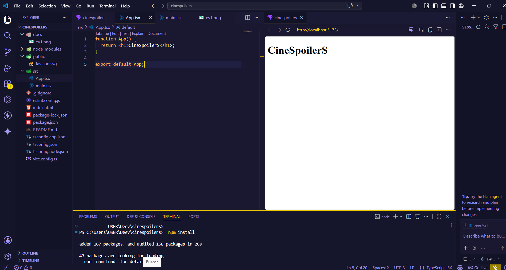

## Evidencia 03

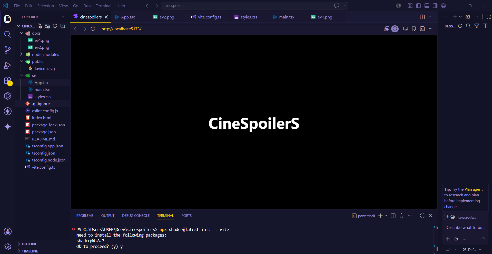

## Evidencia 04

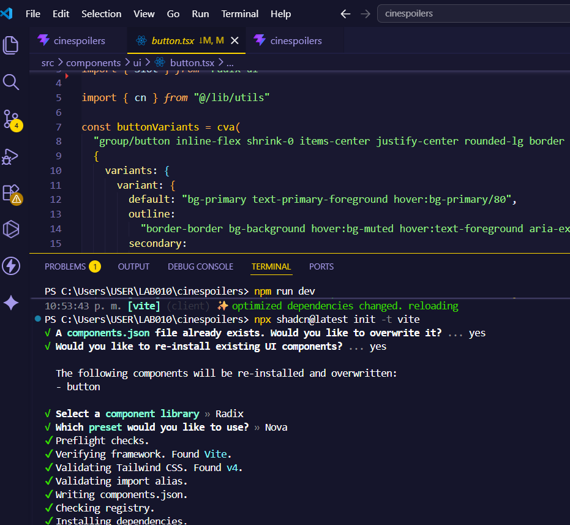

## Evidencia 05

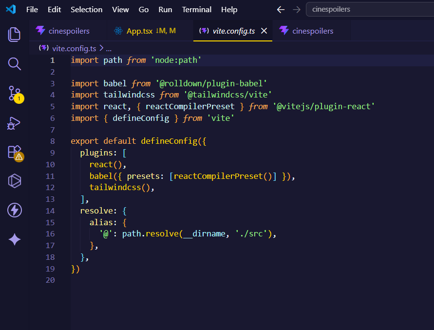

## Evidencia 06

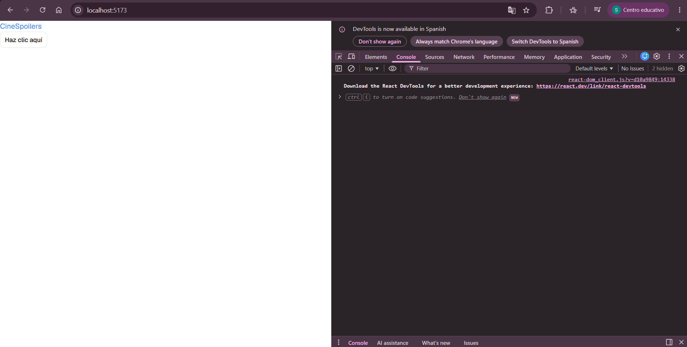
## Evidencia 07

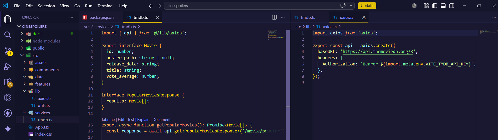
## Evidencia 08

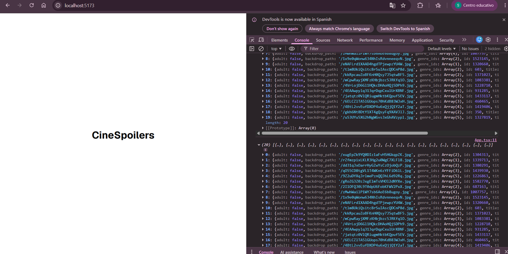
## Evidencia 09

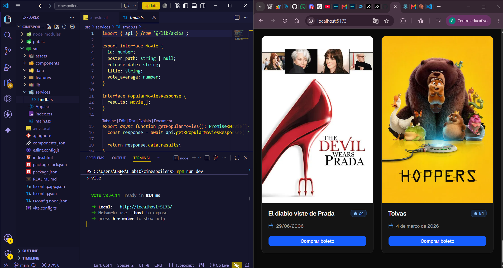